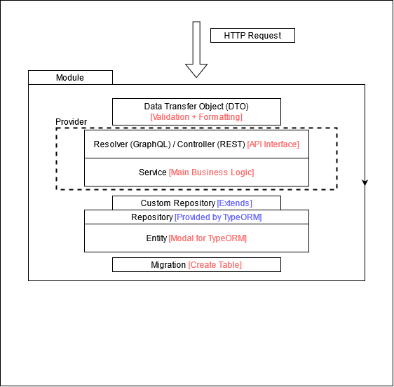
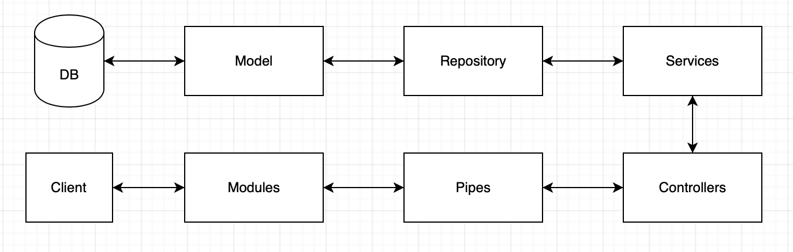

# NestJS Template

## 📓 Commands

```bash
# install dependency
$ yarn install

# build the app and run in production mode
$ yarn start

# run in development mode
$ yarn start:dev || yarn dev

# run in production mode
$ yarn start:prod || yarn prod

# test both unit test and e2e test
$ yarn test

# test all the unit test
$ yarn test:unit

# test all the e2e test
$ yarn test:e2e

# create a new module with defined templete
$ yarn new [module name]
```

**Running the app for development**

```bash
$ git clone [repo]

$ yarn install

$ cp env/.env.example .env

# install SQL driver and fill in missed variables in .env file

# MySQL / MariaDB
# yarn add mysql2

# Microsoft SQL Server
# yarn add mssql

# MongoDB
# yarn add mongodb

# Others: https://www.tutorialspoint.com/typeorm/typeorm_quick_guide.htm

$ chmod +x .husky -R    # Linux / Mac user need (allow git hook script executable)

$ yarn husky install    # add husky git hook to the repo

$ git checkout -B dev   # create and checkout to a development branch (optional)

$ yarn dev
```

## 👍 Recommanded Architecture and Flow





## ⭐ Enhance Coding Quality Tools Used

#### ESLint

It statically analyzes your code to help you detect formatting issues and find code inconsistencies, here we also extend the ESLint Typescript recommend rules and the most popular JavaScript style [Airbnb](https://github.com/airbnb/javascript).

```
# Config File
├── .eslintignore
├── .eslintrc.js
```

Other popular JavaScript style:

- [Standard](https://standardjs.com)
- [Google](https://google.github.io/styleguide/jsguide.html)

#### Prettier

Similar to ESLint, but mainly focus on auto-formatting your code, does not check the code quality. Actually, ESLint can do all the jobs that Prettier can do, but for the formatting part, Prettier does better, so we import both and achieve each of the advantages. About the conflict of the formatting part, we can import `plugin:prettier/recommended` to solve this, but keep in mind that this plugin should extend at the last.

```
# Config File
├── .prettierignore
├── .prettierrc.js
```

#### Editorconfig

It defines a standard code formatting style guide among all the IDEs and editors used within a team of developers. Basically, all the rules in the Editorconfig should sync with Prettier, Editorconfig focus on newly created files, ESLint and Prettier focus on existing files.

```
# Config File
├── .editorconfig
```

#### Husky + CommitLint + Lint-staged

These tools are the wrapper of [Git Hook](https://git-scm.com/book/zh-tw/v2/Customizing-Git-Git-Hooks). Lint-staged enforces you to format your code (run `yarn lint`) before committing, but the tools will cache the file the already formatted, improve performance. CommitLint enforces your commit message to fit a specific format, here we extend [Conventional Commits](https://www.conventionalcommits.org/en/v1.0.0) (officially recommend setting).

```
# Type: build, chore, ci, docs, feat, fix, perf, refactor, revert, style, test
# CommitLint Format:

<type>[optional scope]: <description>
[optional body]
[optional footer(s)]
```

```
# Config File for Lint-staged
├── .lintstagedrc.js

# Config File for CommitLint
├── .commitlintrc.js

# Config File for Husky
├── .husky
|   ├── commit-msg  # call CommitLint to check commit msg
|   ├── pre-commit  # call Eslint to lint the coding issue
|   ├── pre-push    # call Jest to do the unit + e2e test
```

#### Git Attributes

To synchronize the end-of-line of the git repository.

```
# Config File
├── .gitattributes
```

_Reference:_

- [Why You Should Use ESLint, Prettier & EditorConfig](https://blog.theodo.com/2019/08/why-you-should-use-eslint-prettier-and-editorconfig-together)
- [代碼規範最佳實踐](https://codeleading.com/article/47374147761)
- [代碼提交規範](https://segmentfault.com/a/1190000040615432)

## ⚙️ Other Configuration

#### Alias Path

In the tsconfig.json file, there has a 'paths' attribute that can setup alias path, using alias path can prevent dirty relative path (e.g. ../../../), also it is easier to import files that in the deep directory (e.g. src/assets/img/testing/...). Below is the default alias path:

```js
"compilerOptions": {
  ...
  "paths": {
    "@/*": ["src/*"],
    "@entity/*": ["src/database/entities/*"],
    "@migrate/*": ["src/database/migrations/*"],
    "@repo/*": ["src/database/repositories/*"],
    "@sub/*": ["src/database/subscribers/*"]
  },
  ...
}
```

For Jest, it does not recognize tsconfig.json, so we have declare the alias path in `jest.config.js` and `test/jest-e2e.json` file.

```js
moduleNameMapper: {
  '^@/(.*)$': '<rootDir>/$1',
  '^@entity/(.*)$': ['<rootDir>/database/entities/$1'],
  '^@migrate/(.*)$': ['<rootDir>/database/migrations/$1'],
  '^@repo/(.*)$': ['<rootDir>/database/repositories/$1'],
  '^@sub/(.*)$': ['<rootDir>/database/subscribers/$1'],
},
```

#### Internationalization

**Setup**

1. Add `I18nRequestScopeService` in the service constractor's parameter.
2. Put the translated text in `src/i18n/<language>/<namespace>.json`.
3. Call `await this.i18n.t('<json filename>.<json key>')` to get the translated text.

**API Request**

1. Add `lang` or `locale` key in HTTP Header, and the value is the same as the folder name in `src/i18n/`.

Details usage can check the [git repository](https://github.com/ToonvanStrijp/nestjs-i18n)

## 📦 Default Packages Description

```json
{
  "@nestjs/common": "NestJS default package",
  "@nestjs/config": "Library that allow externally defined environment variables [package internally uses dotenv]",
  "@nestjs/core": "NestJS default package",
  "@nestjs/platform-fastify": "http server/framework that NestJS based on [default is Express.js]",
  "@nestjs/throttler": "Security library that protect application from brute-force attacks",
  "@nestjs/typeorm": "NestJS version of TypeORM",
  "class-transformer": "Dependency library of class-validator",
  "class-validator": "DTO validation library",
  "nestjs-i18n": "NestJS version of i18n",
  "reflect-metadata": "NestJS default package",
  "rimraf": "NestJS default package",
  "rxjs": "NestJS default package",
  "typeorm": "ORM library that fully support TypeScript"
}
```

## 📈 Performance Optimization

By default, we used Fastify instead of Express to achieve twice of performance, below is the benchmarks tested by NestJS:

**Express.js**

| Stat      | 1%      | 2.5%    | 50%     | 97.5%   | Avg     | Stdev  | Min     |
| --------- | ------- | ------- | ------- | ------- | ------- | ------ | ------- |
| Req/Sec   | 14183   | 14183   | 15767   | 15991   | 15640   | 501.13 | 14182   |
| Bytes/Sec | 3.06 MB | 3.06 MB | 3.41 MB | 3.45 MB | 3.38 MB | 108 kB | 3.06 MB |

**Fastify**

| Stat      | 1%      | 2.5%    | 50%     | 97.5%   | Avg     | Stdev   | Min     |
| --------- | ------- | ------- | ------- | ------- | ------- | ------- | ------- |
| Req/Sec   | 19935   | 19935   | 33247   | 34111   | 32030.4 | 4103.84 | 19931   |
| Bytes/Sec | 3.03 MB | 3.03 MB | 5.05 MB | 5.19 MB | 4.87 MB | 624 kB  | 3.03 MB |

_Reference:_

- [Benchmarks Output](https://github.com/nestjs/nest/blob/master/benchmarks/all_output.txt)

## ☑️ Style Guide / Naming Convention

`JS variable / function:` lower camel case [e.g. twoWords]

`JS global const + enum's member:` upper case [e.g. TWO_WORDS]

`JS class / interface / enum:` pascal case [e.g. TwoWords]

`i18n's key:` snake case [e.g. two_words]

`Asset name (e.g. image):` kebab case [e.g. two-words]
